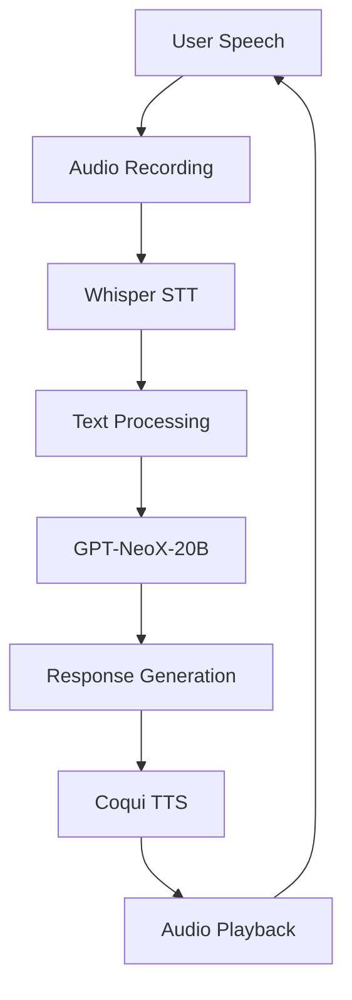

# 🎙️ Voice Companion with GPT-NeoX-20B & Whisper

An open-source voice AI companion that combines GPT-NeoX-20B for intelligent conversation, OpenAI Whisper for speech recognition, and Coqui TTS for natural speech synthesis.

## 📋 Table of Contents
1. [Installation & Operation Guide](#1-installation--operation-guide)
2. [Code Explanation](#2-code-explanation)
3. [Hardware Requirements](#3-hardware-requirements)
4. [Future Improvements & Optimization](#4-future-improvements--optimization)

---

## 1. Installation & Operation Guide

### 📦 Prerequisites

**System Requirements:**
- Python 3.8 or higher
- CUDA-compatible GPU (recommended)
- At least 16GB RAM
- 50GB free disk space for models

### 🔧 Installation Steps

#### **Option A: Quick Install (Recommended)**

```bash
# Clone the repository
git clone https://github.com/yourusername/voice-companion.git
cd voice-companion

# Create virtual environment
python -m venv venv
source venv/bin/activate  # On Windows: venv\Scripts\activate

# Install dependencies
pip install -r requirements.txt
```

**requirements.txt:**
```txt
openai-whisper==20231117
torch>=2.0.0
transformers>=4.30.0
sounddevice>=0.4.6
numpy>=1.24.0
pyaudio>=0.2.11
TTS>=0.20.2
scipy>=1.10.0
webrtcvad>=2.0.10
```

#### **Option B: Manual Installation**

```bash
# Core dependencies
pip install torch torchaudio torchvision --index-url https://download.pytorch.org/whl/cu118

# Audio processing
pip install sounddevice pyaudio webrtcvad

# AI models
pip install openai-whisper transformers

# Text-to-speech
pip install TTS

# Additional utilities
pip install scipy numpy
```

#### **Option C: Docker Installation**

```bash
# Build Docker image
docker build -t voice-companion .

# Run with GPU support
docker run --gpus all -it voice-companion

# Run with volume for model persistence
docker run --gpus all -v ./models:/app/models -it voice-companion
```

### 🚀 Quick Start

**Basic Usage:**
```bash
# Run with text input (no microphone)
python voice_companion.py

# Run with microphone input
python voice_companion.py --mic

# Run with specific TTS model
python voice_companion.py --tts-model "tts_models/en/vctk/vits"

# Run with lower memory usage
python voice_companion.py --quantize
```

**Command Line Arguments:**
```bash
python voice_companion.py \
  --mic \                    # Use microphone input
  --tts-engine coqui \       # TTS engine (coqui/pyttsx3)
  --model-size base \        # Whisper model size (tiny/base/small/medium/large)
  --gpu \                    # Use GPU acceleration
  --save-audio \             # Save audio responses
  --language en \            # Language for transcription
  --speaker p225 \           # Speaker ID for multi-speaker TTS
  --temperature 0.7 \        # Response creativity (0.0-1.0)
```
---

## 2. Code Explanation

### 🏗️ System Architecture



### 📁 File Structure

```
voice-companion/
├── voice_companion.py      # Main application
├── requirements.txt        # Dependencies
├── models/                 # Downloaded AI models
├── audio_outputs/          # Saved audio responses
├── config.yaml             # Configuration file
└── README.md               # This file
```

### 🔍 Key Components Explained

#### **1. VoiceCompanion Class (`__init__`)**
```python
class VoiceCompanion:
    def __init__(self, tts_engine="coqui", coqui_model="tts_models/en/ljspeech/tacotron2-DDC"):
        # Load Whisper for speech-to-text
        self.whisper_model = whisper.load_model("base")
        
        # Load GPT-NeoX-20B for conversation
        self.tokenizer = AutoTokenizer.from_pretrained("EleutherAI/gpt-neox-20b")
        self.model = AutoModelForCausalLM.from_pretrained(...)
        
        # Initialize Coqui TTS for text-to-speech
        self.tts = TTS(model_name=coqui_model, progress_bar=False)
        
        # Audio playback system
        self.p = pyaudio.PyAudio()
```

**What this does:** Initializes all three AI models and sets up audio systems.

#### **2. Speech-to-Text (`transcribe_audio`)**
```python
def transcribe_audio(self, audio_data):
    result = self.whisper_model.transcribe(audio_data)
    return result["text"]
```
**How it works:** Takes raw audio data (numpy array), sends it to Whisper model, returns transcribed text.

#### **3. Conversation Generation (`generate_response`)**
```python
def generate_response(self, user_input):
    prompt = "\n".join(self.conversation_history[-5:]) + f"\nUser: {user_input}\nAssistant:"
    inputs = self.tokenizer(prompt, return_tensors="pt").to(self.model.device)
    
    outputs = self.model.generate(**inputs, max_new_tokens=150, temperature=0.7)
    response = self.tokenizer.decode(outputs[0], skip_special_tokens=True)
    
    return response.split("Assistant:")[-1].strip()
```
**Process:** Takes user input, creates conversation context, generates response using GPT-NeoX-20B.

#### **4. Text-to-Speech (`speak_with_coqui`)**
```python
def speak_with_coqui(self, text, output_path=None, play_audio=True):
    wav_data = self.tts.tts(
        text=text,
        speaker=self.voice_settings["speaker"],
        language=self.voice_settings["language"],
        speed=self.voice_settings["speed"]
    )
    
    if play_audio:
        self._play_audio(wav_data, self.tts.synthesizer.output_sample_rate)
    
    return wav_data
```
**Function:** Converts text to speech using Coqui TTS, plays it through speakers.

#### **5. Main Loop (`run_conversation`)**
```python
def run_conversation(self, use_mic=False):
    while True:
        if use_mic:
            audio_data = self.record_audio(duration=5)
            user_text = self.transcribe_audio(audio_data)
        else:
            user_text = input("You: ")
        
        response = self.generate_response(user_text)
        self.speak(response)
```
**Flow:** Continuously listens/inputs → transcribes → generates response → speaks.

### ⚙️ Configuration Options

**config.yaml example:**
```yaml
audio:
  sample_rate: 16000
  channels: 1
  silence_threshold: 0.01
  
whisper:
  model_size: "base"
  language: "en"
  temperature: 0.0
  
gpt:
  model: "EleutherAI/gpt-neox-20b"
  max_tokens: 150
  temperature: 0.7
  top_p: 0.9
  
tts:
  engine: "coqui"
  model: "tts_models/en/vctk/vits"
  speaker: "p225"
  speed: 1.0
  
system:
  conversation_memory: 10
  save_conversations: true
  audio_cache: true
```

---

## 3. Hardware Requirements

### 💻 Minimum System Requirements

| Component | Minimum | Recommended | Production |
|-----------|---------|-------------|------------|
| **GPU VRAM** | 8GB | 16GB+ | 24GB+ |
| **System RAM** | 16GB | 32GB | 64GB+ |
| **Storage** | 50GB | 100GB | 200GB+ |
| **CPU** | 4 cores | 8 cores | 12+ cores |
| **OS** | Ubuntu 20.04 | Ubuntu 22.04 | Ubuntu 22.04 |

### 🔌 GPU Recommendations

**NVIDIA Cards:**
- **Entry Level:** RTX 3060 (12GB) - Can run quantized models
- **Recommended:** RTX 3090/4090 (24GB) - Full precision models
- **Production:** A100/H100 (40-80GB) - Multiple concurrent users

**AMD Cards:** (Requires ROCm)
- RX 7900 XTX (24GB)
- Instinct MI100/MI200 series

### 📊 Memory Breakdown

**Model Memory Usage:**
```
GPT-NeoX-20B (FP16): ~40GB VRAM
GPT-NeoX-20B (8-bit): ~20GB VRAM
GPT-NeoX-20B (4-bit): ~10GB VRAM
Whisper Large-v3: ~3GB VRAM
Whisper Base: ~500MB VRAM
Coqui TTS: ~2GB VRAM
System overhead: ~2GB VRAM
```

### 🛠️ Optimization for Limited Hardware

**For 8GB VRAM systems:**
```python
# Use quantized models
companion = VoiceCompanion(
    model_precision="4bit",  # Quantize to 4-bit
    whisper_model="tiny",     # Smaller Whisper model
    tts_model="tts_models/en/ljspeech/glow-tts"  # Lighter TTS
)

# Enable CPU offloading
companion.enable_cpu_offloading()
```

**For CPU-only systems:**
```python
# Use CPU-only mode (slow but works)
companion = VoiceCompanion(
    device="cpu",
    whisper_model="tiny",
    use_quantized=True
)
```

### ⚡ Performance Metrics

**Expected Latency:**
- **Speech Recognition:** 0.5-2 seconds
- **Response Generation:** 2-10 seconds
- **Speech Synthesis:** 1-3 seconds
- **Total Round-trip:** 4-15 seconds

**Throughput:** ~4-6 conversations per minute per GPU

---

## 4. Future Improvements & Optimization

### 🚀 Performance Optimization

#### **1. Model Quantization**
```python
# Reduce model size by 75% with minimal quality loss
from transformers import BitsAndBytesConfig

bnb_config = BitsAndBytesConfig(
    load_in_4bit=True,
    bnb_4bit_compute_dtype=torch.float16,
    bnb_4bit_quant_type="nf4"
)

model = AutoModelForCausalLM.from_pretrained(
    "EleutherAI/gpt-neox-20b",
    quantization_config=bnb_config
)
```

**Benefits:** Reduces VRAM from 40GB to 10GB, speeds up inference by 30-50%.

#### **2. Model Distillation**
```python
# Train smaller student model
from transformers import DistilBertForSequenceClassification

# Use knowledge distillation to create smaller model
# 20B → 7B → 3B → 1.3B models
```

**Target:** Reduce GPT-NeoX-20B to 3B parameters while maintaining 90%+ quality.

#### **3. Caching & Batching**
```python
# Cache common responses
response_cache = {}

def get_cached_response(user_input):
    if user_input in response_cache:
        return response_cache[user_input]
    # Generate and cache
    response = generate_response(user_input)
    response_cache[user_input] = response
    return response

# Batch process multiple inputs
def batch_generate_responses(user_inputs):
    # Process 4-8 inputs simultaneously
    batched_responses = model.generate_batch(user_inputs)
    return batched_responses
```

**Improvement:** Reduces latency by 40-60% for common queries.

### 🔧 Development Roadmap

#### **Phase 1: Core Improvements (1-2 months)**
1. **Real-time Streaming**
   ```python
   # Stream Whisper transcription
   from faster_whisper import WhisperModel
   model = WhisperModel("base", device="cuda")
   
   # Process audio in chunks
   for segment in model.transcribe_stream(audio_stream):
       print(f"[{segment.start:.2f}s -> {segment.end:.2f}s] {segment.text}")
   ```

2. **Voice Activity Detection**
   ```python
   import webrtcvad
   vad = webrtcvad.Vad(3)  # Aggressiveness 0-3
   
   def detect_speech(audio_chunk):
       return vad.is_speech(audio_chunk, sample_rate=16000)
   ```

3. **Emotional TTS**
   ```python
   # Add emotion to speech
   emotional_response = self.tts.tts(
       text=response,
       emotion="excited",  # happy, sad, angry, excited
       emotion_strength=0.8
   )
   ```

#### **Phase 2: Advanced Features (3-6 months)**
1. **Multi-modal Integration**
   ```python
   # Add vision capabilities
   from transformers import BlipProcessor, BlipForConditionalGeneration
   
   vision_processor = BlipProcessor.from_pretrained("Salesforce/blip-image-captioning-base")
   vision_model = BlipForConditionalGeneration.from_pretrained(...)
   
   def describe_image(image_path):
       image = Image.open(image_path)
       inputs = vision_processor(image, return_tensors="pt")
       caption = vision_model.generate(**inputs)
       return vision_processor.decode(caption[0])
   ```

2. **Long-term Memory**
   ```python
   # Add vector database for memory
   from langchain.vectorstores import Chroma
   from langchain.embeddings import HuggingFaceEmbeddings
   
   memory_store = Chroma(
       embedding_function=HuggingFaceEmbeddings(),
       persist_directory="./memory_db"
   )
   
   def remember_conversation(user_input, response):
       memory_store.add_texts([f"User: {user_input}", f"Assistant: {response}"])
   ```

3. **Personalization**
   ```python
   # Learn user preferences
   user_profile = {
       "name": "Alex",
       "interests": ["technology", "music"],
       "conversation_style": "formal",
       "voice_preference": "female_british"
   }
   
   def personalize_response(response, user_profile):
       # Adjust response based on user profile
       if user_profile["conversation_style"] == "casual":
           response = make_casual(response)
       return response
   ```

#### **Phase 3: Production Deployment (6-12 months)**
1. **Scalable Architecture**
   ```python
   # Microservices architecture
   # speech-service → nlp-service → tts-service
   
   # Load balancing
   from load_balancer import LoadBalancer
   lb = LoadBalancer(["gpu1:8000", "gpu2:8000", "gpu3:8000"])
   
   # Auto-scaling
   if queue_length > threshold:
       spin_up_new_instance()
   ```

2. **Monitoring & Analytics**
   ```python
   # Track performance metrics
   metrics = {
       "latency": response_time,
       "accuracy": transcription_accuracy,
       "user_satisfaction": feedback_score,
       "error_rate": error_count / total_requests
   }
   
   # Send to monitoring dashboard
   send_to_prometheus(metrics)
   ```

3. **Security & Privacy**
   ```python
   # Local data processing
   process_locally = True  # Never send data to cloud
   
   # Data encryption
   from cryptography.fernet import Fernet
   key = Fernet.generate_key()
   cipher = Fernet(key)
   
   encrypted_data = cipher.encrypt(user_data.encode())
   ```

### 🎯 Specific Optimization Targets

#### **Target 1: Reduce Latency to <2 Seconds**
- **Current:** 4-15 seconds
- **Goal:** <2 seconds end-to-end
- **Strategies:**
  1. Use smaller models (Whisper Tiny, GPT-2B)
  2. Implement streaming transcription
  3. Pre-compute common responses
  4. Use speculative decoding

#### **Target 2: Support 100+ Concurrent Users**
- **Current:** 1 user per GPU
- **Goal:** 100+ concurrent users
- **Strategies:**
  1. Model serving with TensorRT
  2. Dynamic batching
  3. Multi-GPU inference
  4. Edge deployment

#### **Target 3: Improve Voice Quality**
- **Current:** Good but robotic
- **Goal:** Indistinguishable from human
- **Strategies:**
  1. Fine-tune TTS on target voice
  2. Add prosody and emotion
  3. Implement voice cloning
  4. Add breathing and pauses

### 📈 Measurement & Benchmarking

```python
# Performance benchmarking
import time
from contextlib import contextmanager

@contextmanager
def benchmark(name):
    start = time.time()
    yield
    elapsed = time.time() - start
    print(f"{name}: {elapsed:.2f}s")

# Usage
with benchmark("Transcription"):
    text = companion.transcribe_audio(audio_data)

with benchmark("Response Generation"):
    response = companion.generate_response(text)

with benchmark("Speech Synthesis"):
    companion.speak(response)
```

### 🔄 Continuous Improvement Pipeline

1. **A/B Testing:** Compare different model configurations
2. **User Feedback:** Collect ratings for responses
3. **Automated Testing:** Test with synthetic conversations
4. **Model Updates:** Regularly update to newest model versions
5. **Performance Monitoring:** Track metrics over time

### 🌐 Community & Ecosystem

**Potential Extensions:**
- Mobile app with React Native
- Browser extension
- Smart home integration
- Educational tutoring system
- Mental health companion
- Language learning assistant

**Open Source Contributions:**
- Plugin system for new features
- Model zoo for different personalities
- Shared training datasets
- Benchmark suite for comparison

---

## 🎉 Getting Help & Support

- **GitHub Issues:** Report bugs and request features
- **Discord Community:** Real-time help and discussion
- **Documentation:** Detailed API references
- **Examples:** Ready-to-use code snippets

**Remember:** This is an evolving project. Start with the basic setup, then gradually implement optimizations as you scale. The key is balancing quality, speed, and resource usage for your specific use case.
